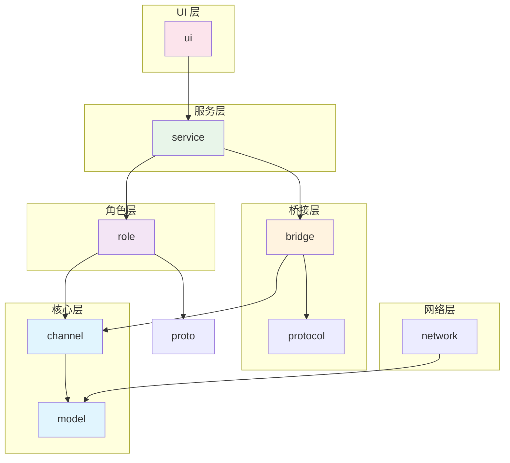
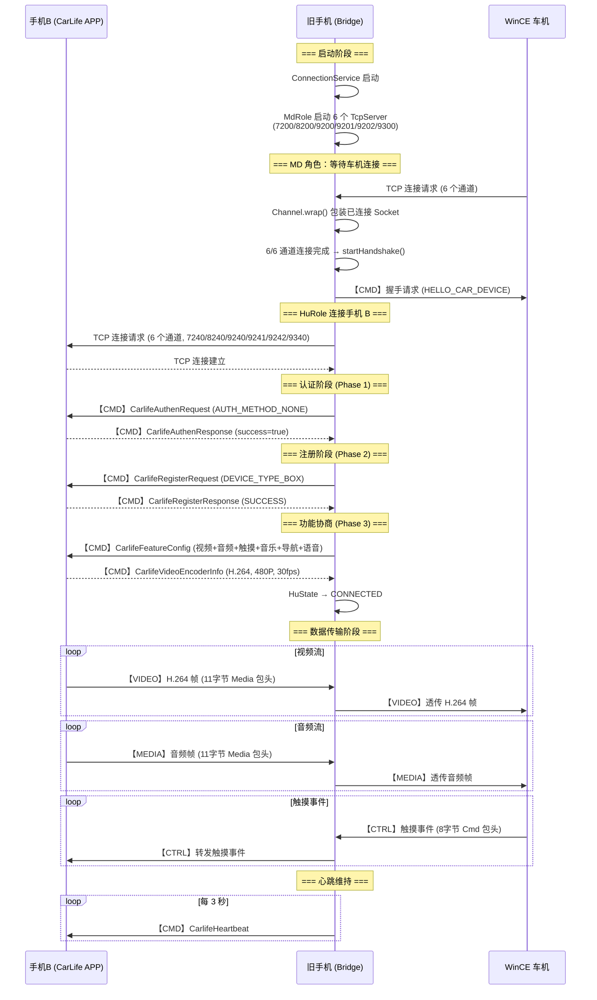
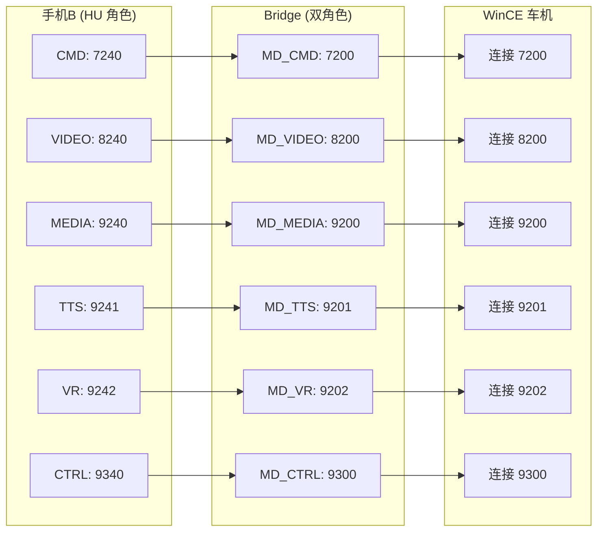

# CarLifeWirelessBox 系统架构文档

> **项目目标**：将旧 Android 手机改造为无线 CarLife 转接盒  
> **架构版本**：v1.2（与代码同步）  
> **日期**：2026-05-11

---

## 目录

1. [项目结构](#1-项目结构)
2. [模块依赖关系图](#2-模块依赖关系图)
3. [数据流时序图](#3-数据流时序图)
4. [核心数据结构/接口定义](#4-核心数据结构接口定义)
5. [Gradle 依赖清单](#5-gradle-依赖清单)
6. [共享约定](#6-共享约定)
7. [Protobuf 处理方案](#7-protobuf-处理方案)
8. [关键技术点说明](#8-关键技术点说明)

---

## 1. 项目结构

### 1.1 实际文件列表

```
CarLifeWirelessBox/
├── app/
│   ├── build.gradle.kts                    # 应用模块构建配置
│   ├── proguard-rules.pro                  # 混淆规则
│   └── src/
│       ├── main/
│       │   ├── AndroidManifest.xml
│       │   ├── java/com/carlife/wireless/
│       │   │   ├── CarLifeApplication.kt   # Application 入口
│       │   │   ├── channel/
│       │   │   │   └── Channel.kt          # 通道抽象（ChannelType, DeviceRole, Channel, TcpChannel, TcpServerChannel）
│       │   │   ├── model/
│       │   │   │   ├── ChannelHeader.kt    # 协议包头（Cmd 8字节, Media 11字节）
│       │   │   │   └── KConnectionState.kt # 连接状态枚举
│       │   │   ├── network/
│       │   │   │   ├── TcpClient.kt        # TCP 客户端（协议分帧、心跳、重连）
│       │   │   │   └── TcpServer.kt        # TCP 服务端（多客户端管理）
│       │   │   ├── role/
│       │   │   │   ├── HuRole.kt           # HU 角色（连接手机 B，协议握手）
│       │   │   │   └── MdRole.kt           # MD 角色（监听车机连接）
│       │   │   ├── bridge/
│       │   │   │   ├── StreamBridge.kt     # 数据流桥接器
│       │   │   │   └── StreamBridgeManager.kt # 桥接管理器
│       │   │   ├── protocol/
│       │   │   │   ├── ProtocolTranslator.kt # 协议版本/编解码转换
│       │   │   │   └── VersionDetector.kt  # 版本检测
│       │   │   ├── service/
│       │   │   │   ├── ConnectionService.kt # 连接服务（前台服务，协调 MdRole/HuRole）
│       │   │   │   ├── ProtocolService.kt  # 协议服务（占位）
│       │   │   │   ├── VideoService.kt     # 视频服务（占位）
│       │   │   │   ├── AudioService.kt     # 音频服务（占位）
│       │   │   │   └── TouchService.kt     # 触摸服务（占位）
│       │   │   ├── ui/
│       │   │   │   ├── MainActivity.kt     # 主界面
│       │   │   │   ├── SettingsActivity.kt # 设置界面
│       │   │   │   └── LogViewerActivity.kt # 日志查看器
│       │   │   ├── receiver/
│       │   │   │   ├── BootReceiver.kt     # 开机自启
│       │   │   │   └── WifiStateReceiver.kt # WiFi 状态监听
│       │   │   └── util/
│       │   │       ├── Constants.kt        # 协议常量（端口、超时等）
│       │   │       ├── ByteUtils.kt        # 字节操作工具
│       │   │       ├── LogUtils.kt         # 日志工具（支持文件保存）
│       │   │       ├── LogFileManager.kt   # 日志文件管理
│       │   │       ├── NetworkUtils.kt     # 网络工具
│       │   │       └── SettingsManager.kt  # 设置管理（SharedPreferences）
│       │   ├── proto/                      # 28 个 .proto 文件
│       │   │   ├── carlife_common.proto
│       │   │   ├── carlife_cmd.proto
│       │   │   ├── carlife_heartbeat.proto
│       │   │   ├── CarlifeAuthenRequestProto.proto
│       │   │   ├── CarlifeAuthenResponseProto.proto
│       │   │   ├── CarlifeRegisterRequestProto.proto
│       │   │   ├── CarlifeRegisterResponseProto.proto
│       │   │   ├── CarlifeFeatureConfigProto.proto
│       │   │   ├── CarlifeVideoEncoderInfoProto.proto
│       │   │   └── ... (共 28 个)
│       │   └── res/
│       │       ├── layout/                 # 4 个布局文件
│       │       ├── values/                 # strings, colors, styles, arrays
│       │       ├── menu/                   # main_menu, log_viewer_menu
│       │       ├── drawable/               # 图标
│       │       ├── mipmap/                 # 启动图标
│       │       └── xml/                    # file_paths, data_extraction_rules
│       └── test/                           # （待添加）
├── docs/
│   ├── ARCHITECTURE.md                     # 本文档
│   ├── PRD.md                              # 产品需求文档
│   ├── 项目技术文档.md                      # CarLife 协议技术调研
│   └── 参考app分析.md                       # 百度 CarLife 参考 APP 分析
├── 参考app/                                # 参考 APP 反编译资源
├── build.gradle.kts                        # 根项目构建配置
├── settings.gradle.kts                     # 项目设置
├── gradle.properties                       # Gradle 属性
├── gradlew / gradlew.bat                   # Gradle Wrapper
├── generate_icons.py                       # 图标生成脚本
└── README.md
```

### 1.2 包结构说明

| 包名 | 职责 |
|------|------|
| `channel` | 通道抽象层（ChannelType 枚举、Channel 抽象类、TCP 实现） |
| `model` | 数据模型（协议包头 ChannelHeader、连接状态 KConnectionState） |
| `network` | 网络层（TcpClient 客户端、TcpServer 服务端） |
| `role` | 双角色逻辑（HuRole 连接手机 B、MdRole 监听车机） |
| `bridge` | 数据桥接（StreamBridge 单通道桥接、StreamBridgeManager 管理器） |
| `protocol` | 协议处理（ProtocolTranslator 版本转换、VersionDetector 版本检测） |
| `service` | Android 服务（ConnectionService 核心协调、Video/Audio/Touch 占位） |
| `ui` | 用户界面（MainActivity、SettingsActivity、LogViewerActivity） |
| `receiver` | 广播接收器（开机自启、WiFi 状态变化） |
| `util` | 工具类（常量、字节操作、日志、网络、设置） |

---

## 2. 模块依赖关系图



### 关键设计决策

**统一通道抽象**：`Channel` 类同时被 `HuRole`（客户端连接）和 `MdRole`（服务端接受连接）使用，确保协议分帧和包头处理的一致性。

- `Channel.create(type, role)` → 创建 TCP 客户端通道（HuRole 使用）
- `Channel.wrap(type, role, socket)` → 包装已连接 Socket（TcpServer/MdRole 使用）

---

## 3. 数据流时序图

### 3.1 完整握手与数据传输时序



### 3.2 通道端口映射



---

## 4. 核心数据结构/接口定义

### 4.1 通道模型 (channel/)

```kotlin
// ChannelType.kt — 6 种 CarLife 通道
enum class ChannelType(val huPort: Int, val mdPort: Int) {
    HU_CMD(7240, 7200),
    HU_VIDEO(8240, 8200),
    HU_MEDIA(9240, 9200),
    HU_TTS(9241, 9201),
    HU_VR(9242, 9202),
    HU_CTRL(9340, 9300);

    fun getPort(role: DeviceRole): Int
    fun isMediaChannel(): Boolean  // VIDEO/MEDIA/TTS/VR → true
}

// DeviceRole.kt
enum class DeviceRole { HU, MOBILE }

// Channel.kt — 抽象通道
abstract class Channel(val type: ChannelType, val role: DeviceRole) {
    var state: KConnectionState
    var callback: ChannelCallback?
    val isConnected: Boolean

    fun send(payloadType: Int, payload: ByteArray, timestamp: Int = 0): Boolean
    fun connect(host: String, port: Int)
    fun disconnect(reason: String? = null)
    fun read(): Pair<ChannelHeader, ByteArray>?
}
```

### 4.2 协议包头 (model/)

```kotlin
// CMD 通道包头（8 字节）
// ┌───────┬─────────────┬──────────────┬─────┬─────┐
// │ magic │ payloadType │ payloadLength│ crc │     │
// │ 2B    │ 1B          │ 4B           │ 1B  │     │
// └───────┴─────────────┴──────────────┴─────┴─────┘
data class Cmd(
    val payloadType: Int,
    val payloadLength: Int,
    val crc: Byte = 0
) : ChannelHeader()

// 媒体通道包头（11 字节）
// ┌───────┬─────────────┬───────────┬──────────────┐
// │ magic │ payloadType │ timestamp │ payloadLength│
// │ 2B    │ 1B          │ 4B        │ 4B           │
// └───────┴─────────────┴───────────┴──────────────┘
data class Media(
    val payloadType: Int,
    val timestamp: Int,
    val payloadLength: Int
) : ChannelHeader()
```

### 4.3 角色接口 (role/)

```kotlin
// HuRole — HU 角色（连接手机 B）
class HuRole(context: Context, phoneBIp: String, listener: HuRoleListener? = null) {
    // listener 为构造函数属性，自动生成 getter/setter
    fun connect()
    fun disconnect(reason: String?)
    fun release()
    fun getState(): HuState
    fun isConnected(): Boolean
}

interface HuRoleListener {
    fun onStateChanged(state: HuState, reason: String?)
    fun onVideoFrameReceived(header: ChannelHeader.Media, frame: ByteArray)
    fun onAudioFrameReceived(header: ChannelHeader.Media, frame: ByteArray)
    fun onTtsFrameReceived(header: ChannelHeader.Media, data: ByteArray)
    fun onVrFrameReceived(header: ChannelHeader.Media, data: ByteArray)
    fun onControlReceived(header: ChannelHeader.Cmd, payload: ByteArray)
    fun onError(error: String)
}

// MdRole — MD 角色（监听车机）
class MdRole(context: Context) {
    fun start()   // 启动 6 个 TcpServer
    fun stop()
    fun setStateListener(listener: (MdState) -> Unit)
    fun setHuRole(huRole: HuRole)
    fun isReady(): Boolean
}
```

### 4.4 网络层 (network/)

```kotlin
// TcpServer — 监听端口，接受客户端连接
class TcpServer(type: ChannelType, role: DeviceRole, listener: TcpServerListener) {
    fun start(port: Int)
    fun stop()
    fun release()  // stop + 取消协程
}

// TcpClient — TCP 客户端（支持协议分帧、心跳、重连）
class TcpClient(context: Context, listener: TcpClientListener) {
    fun connect(host: String, port: Int)
    fun disconnect()
    fun sendData(header: ChannelHeader, payload: ByteArray): Boolean
}
```

---

## 5. Gradle 依赖清单

### 5.1 根项目 build.gradle.kts

```kotlin
plugins {
    id("com.android.application") version "8.2.2" apply false
    id("org.jetbrains.kotlin.android") version "1.9.24" apply false
    id("com.google.protobuf") version "0.9.4" apply false
}
```

### 5.2 应用模块 build.gradle.kts

| 依赖 | 版本 | 用途 |
|------|------|------|
| `androidx.core:core-ktx` | 1.12.0 | AndroidX 核心 |
| `androidx.appcompat:appcompat` | 1.6.1 | 向后兼容 |
| `com.google.android.material:material` | 1.11.0 | Material Design |
| `androidx.constraintlayout:constraintlayout` | 2.1.4 | 布局 |
| `androidx.lifecycle:lifecycle-*` | 2.7.0 | 生命周期 |
| `org.jetbrains.kotlin:kotlin-stdlib` | 1.9.24 | Kotlin 标准库 |
| `org.jetbrains.kotlinx:kotlinx-coroutines-*` | 1.7.3 | 协程 |
| `com.google.protobuf:protobuf-javalite` | 3.25.1 | Protobuf Lite |
| `com.squareup.okhttp3:okhttp` | 4.12.0 | HTTP 客户端 |
| `org.java-websocket:Java-WebSocket` | 1.5.4 | WebSocket |
| `com.google.code.gson:gson` | 2.10.1 | JSON |
| `com.elvishew:xlog` | 1.11.1 | 日志（未使用，保留） |

### 5.3 Gradle 属性

```properties
org.gradle.jvmargs=-Xmx2048m -Dfile.encoding=UTF-8
android.useAndroidX=true
kotlin.code.style=official
android.nonTransitiveRClass=true
protobuf.version=3.25.1
# org.gradle.java.home=<本地 JDK 17 路径>
```

---

## 6. 共享约定

### 6.1 端口定义

```kotlin
// HU 侧端口（手机 B / CarLife APP）
object Port {
    const val HU_CMD   = 7240
    const val HU_VIDEO = 8240
    const val HU_MEDIA = 9240
    const val HU_TTS   = 9241
    const val HU_VR    = 9242
    const val HU_CTRL  = 9340
}

// MD 侧端口（车机连接目标）
object PortMD {
    const val MD_CMD   = 7200
    const val MD_VIDEO = 8200
    const val MD_MEDIA = 9200
    const val MD_TTS   = 9201
    const val MD_VR    = 9202
    const val MD_CTRL  = 9300
}
```

### 6.2 心跳参数

| 参数 | 值 | 说明 |
|------|-----|------|
| 心跳间隔 | 3000ms | 每 3 秒发送一次 |
| 心跳超时 | 9000ms | 3 次未收到则判定断开 |

### 6.3 日志规范

- 使用 `LogUtils` 工具类，TAG 格式：`CarLifeWireless`
- 支持日志保存到文件（`LogFileManager`，保留 7 天）
- 级别：D(调试) / I(信息) / W(警告) / E(错误)

---

## 7. Protobuf 处理方案

### 7.1 方案：protobuf-javalite

使用 `protobuf-javalite`（适合移动端），通过 Gradle 插件自动生成 Java 类。

### 7.2 .proto 文件组织

所有 `.proto` 文件位于 `app/src/main/proto/`，统一使用：

```protobuf
syntax = "proto3";
package carlife;
option java_package = "com.carlife.wireless.proto";
option java_outer_classname = "XxxProto";
```

### 7.3 关键 Proto 文件

| 文件 | 外部类名 | 关键消息 |
|------|---------|---------|
| `CarlifeAuthenRequestProto.proto` | `CarlifeAuthenRequestProto` | `CarlifeAuthenRequest` |
| `CarlifeAuthenResponseProto.proto` | `CarlifeAuthenResponseProto` | `CarlifeAuthenResponse` |
| `CarlifeRegisterRequestProto.proto` | `CarlifeRegisterRequestProto` | `CarlifeRegisterRequest` |
| `CarlifeRegisterResponseProto.proto` | `CarlifeRegisterResponseProto` | `CarlifeRegisterResponse` |
| `CarlifeFeatureConfigProto.proto` | `CarlifeFeatureConfigProto` | `CarlifeFeatureConfig` |
| `CarlifeVideoEncoderInfoProto.proto` | `CarlifeVideoEncoderInfoProto` | `CarlifeVideoEncoderInfo` |
| `carlife_heartbeat.proto` | `CarlifeHeartbeatProto` | `CarlifeHeartbeat` |
| `carlife_auth_method.proto` | `CarlifeAuthMethodProto` | `AuthMethod` (enum) |
| `carlife_device_info.proto` | `CarlifeDeviceInfoProto` | `CarlifeDeviceInfo`, `DeviceType`, `OsType` |
| `carlife_register_type.proto` | `CarlifeRegisterTypeProto` | `RegisterType`, `RegisterResultCode` (enum) |

---

## 8. 关键技术点说明

### 8.1 认证绕过

HuRole 发送 `AuthMethod.AUTH_METHOD_NONE`，不进行真正的认证。对于不支持认证的旧版 CarLife（6.7.2），直接视为成功。

### 8.2 协议版本锁定

强制使用协议版本 `1.0`，确保与 CarLife 6.7.2 兼容。`VersionDetector` 检测高版本（7.2+）时标记需要协议转换。

### 8.3 视频流透传

当前视频流直接透传，不做编解码转换。`ProtocolTranslator` 提供了 H.265→H.264 和 Opus→AAC 的转换框架（TODO：MediaCodec 实现）。

### 8.4 双角色架构

- **MdRole**（MD 角色）：启动 6 个 TcpServer 监听车机连接，负责车机侧握手
- **HuRole**（HU 角色）：通过 6 个 Channel 主动连接手机 B，完成 CarLife 协议认证/注册/协商
- **StreamBridge**：在两个角色之间转发音视频和控制数据

### 8.5 Channel 统一抽象

`Channel` 类统一了客户端和服务端的通道操作：
- 客户端：`Channel.create()` → `TcpChannel`（主动 connect）
- 服务端：`Channel.wrap()` → `TcpServerChannel`（包装已连接 Socket）
- 两者共享相同的协议分帧（`read()`/`send()`）和状态管理

### 8.6 开发进度

**已完成模块**：
- ✅ 通道抽象层（Channel / ChannelType / DeviceRole）
- ✅ 网络层（TcpServer / TcpClient，支持心跳、重连、协程）
- ✅ HU 角色（HuRole，完整 3 阶段握手：认证 → 注册 → 功能协商）
- ✅ MD 角色（MdRole，6 端口监听，简化握手）
- ✅ 数据桥接（StreamBridge / StreamBridgeManager）
- ✅ 协议转换框架（ProtocolTranslator / VersionDetector）
- ✅ 连接服务（ConnectionService 前台服务 + mDNS 广播）
- ✅ UI 界面（主界面 / 设置 / 日志查看器）
- ✅ Protobuf 定义（28 个 proto 文件）
- ✅ 工具类（日志文件轮转 / 网络检测 / 设置管理）

**待实现模块**：
- 🔲 VideoService — MediaProjection 屏采 + MediaCodec H.264 编码（P0）
- 🔲 AudioService — 音频采集 + AAC 编码（P1）
- 🔲 TouchService — 触摸事件注入（P1）
- 🔲 StreamBridge 接入 ConnectionService（P0）
- 🔲 MdRole 完整协议握手（P0）
- 🔲 断线自动重连（P1）

---

## 变更记录

| 版本 | 日期 | 变更内容 |
|------|------|---------|
| v1.2 | 2026-05-11 | 更新 HuRole 接口定义（移除冗余 setListener）；新增开发进度章节 |
| v1.1 | 2026-05-11 | 与代码同步，完善模块依赖图和时序图 |
| v1.0 | 2026-05-10 | 初始版本 |
