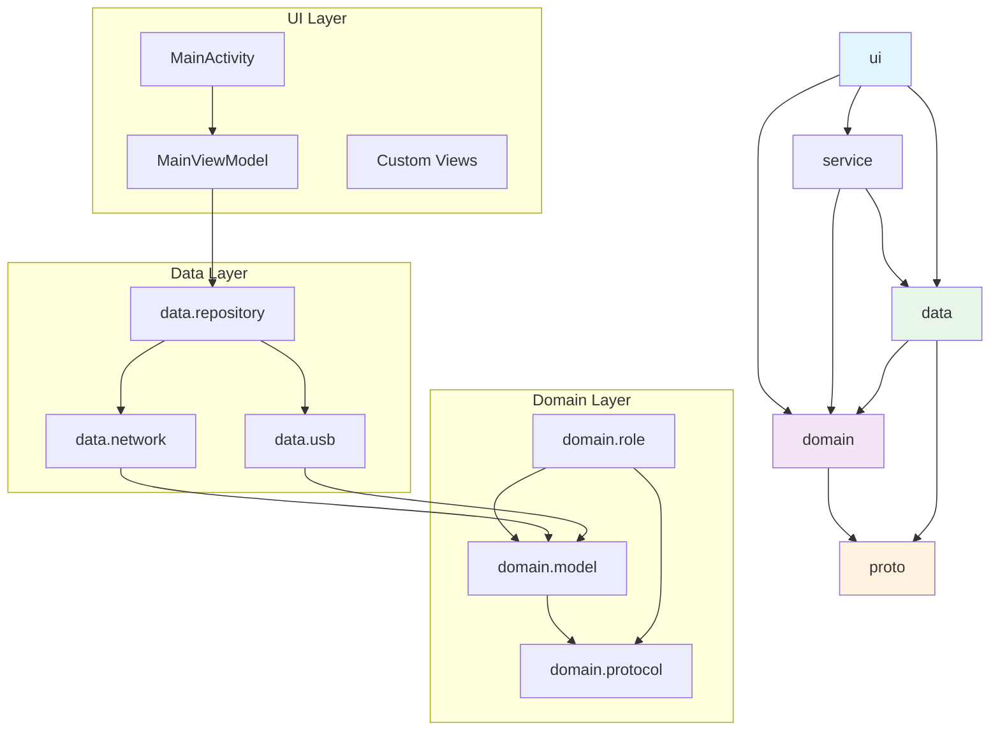
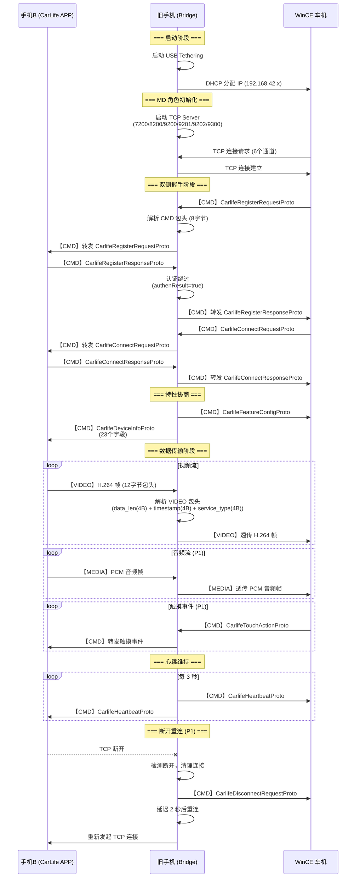
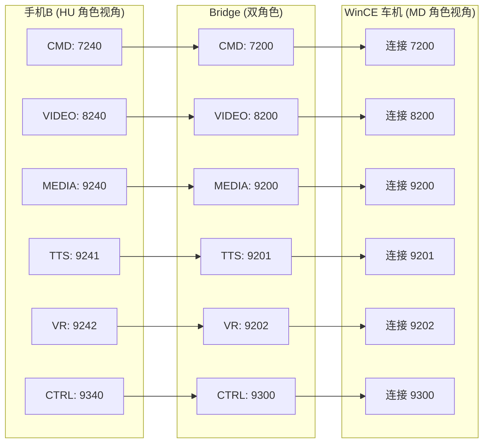
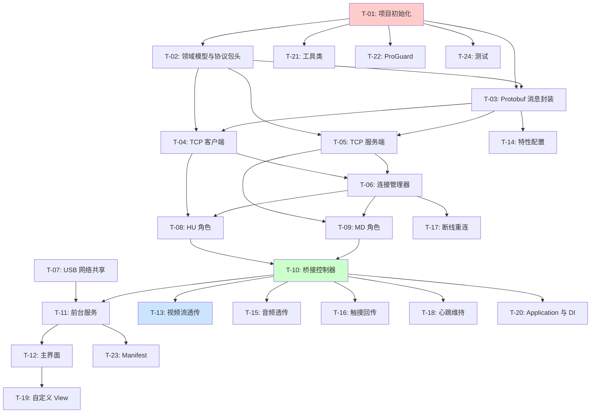

# CarLifeWirelessBox 系统架构文档

> **项目目标**：将旧 Android 手机改造为无线 CarLife 转接盒  
> **架构版本**：v1.0  
> **日期**：2026-05-10  
> **作者**：高见远（架构师）

---

## 目录

1. [项目结构](#1-项目结构)
2. [模块依赖关系图](#2-模块依赖关系图)
3. [数据流时序图](#3-数据流时序图)
4. [核心数据结构/接口定义](#4-核心数据结构接口定义)
5. [Gradle 依赖清单](#5-gradle-依赖清单)
6. [任务列表（实现顺序）](#6-任务列表实现顺序)
7. [共享约定](#7-共享约定)
8. [Protobuf 处理方案](#8-protobuf-处理方案)

---

## 1. 项目结构

### 1.1 完整文件列表

```
CarLifeWirelessBox/
├── app/
│   ├── build.gradle.kts
│   ├── proguard-rules.pro
│   └── src/
│       ├── main/
│       │   ├── AndroidManifest.xml
│       │   ├── java/com/carlife/wireless/
│       │   │   ├── CarLifeApplication.kt
│       │   │   ├── ui/
│       │   │   │   ├── MainActivity.kt
│       │   │   │   ├── MainViewModel.kt
│       │   │   │   ├── view/
│       │   │   │   │   ├── StatusCardView.kt
│       │   │   │   │   └── LogTextView.kt
│       │   │   │   └── adapter/
│       │   │   │       └── LogAdapter.kt
│       │   │   ├── service/
│       │   │   │   └── CarLifeBridgeService.kt
│       │   │   ├── domain/
│       │   │   │   ├── model/
│       │   │   │   │   ├── Channel.kt
│       │   │   │   │   ├── ConnectionState.kt
│       │   │   │   │   ├── DeviceInfo.kt
│       │   │   │   │   ├── VideoConfig.kt
│       │   │   │   │   ├── AudioConfig.kt
│       │   │   │   │   └── TouchEvent.kt
│       │   │   │   ├── protocol/
│       │   │   │   │   ├── ProtocolVersion.kt
│       │   │   │   │   ├── MessageType.kt
│       │   │   │   │   ├── ChannelHeader.kt
│       │   │   │   │   ├── CmdChannelParser.kt
│       │   │   │   │   ├── MediaChannelParser.kt
│       │   │   │   │   └── ProtobufMessage.kt
│       │   │   │   └── role/
│       │   │   │       ├── HuRole.kt
│       │   │   │       ├── MdRole.kt
│       │   │   │       └── BridgeController.kt
│       │   │   ├── data/
│       │   │   │   ├── network/
│       │   │   │   │   ├── TcpClient.kt
│       │   │   │   │   ├── TcpServer.kt
│       │   │   │   │   ├── ChannelConnection.kt
│       │   │   │   │   └── ConnectionManager.kt
│       │   │   │   ├── usb/
│       │   │   │   │   ├── UsbTetheringManager.kt
│       │   │   │   │   └── DhcpMonitor.kt
│       │   │   │   └── repository/
│       │   │   │       └── BridgeRepository.kt
│       │   │   ├── di/
│       │   │   │   └── AppModule.kt
│       │   │   └── util/
│       │   │       ├── Constants.kt
│       │   │       ├── NetworkUtils.kt
│       │   │       ├── ByteUtils.kt
│       │   │       └── LogUtils.kt
│       │   └── res/
│       │       ├── layout/
│       │       │   ├── activity_main.xml
│       │       │   ├── view_status_card.xml
│       │       │   └── view_log_text.xml
│       │       ├── values/
│       │       │   ├── strings.xml
│       │       │   ├── colors.xml
│       │       │   └── themes.xml
│       │       └── drawable/
│       │           ├── ic_status_connected.xml
│       │           └── ic_status_disconnected.xml
│       └── test/
│           └── java/com/carlife/wireless/
│               ├── domain/protocol/
│               │   ├── CmdChannelParserTest.kt
│               │   └── ChannelHeaderTest.kt
│               └── data/network/
│                   └── TcpClientTest.kt
├── proto/
│   ├── CarlifeProtocolVersionProto.proto
│   ├── CarlifeDeviceInfoProto.proto
│   ├── CarlifeVideoEncoderInfoProto.proto
│   ├── CarlifeMusicInitProto.proto
│   ├── CarlifeTouchActionProto.proto
│   ├── CarlifeAuthenRequestProto.proto
│   ├── CarlifeAuthenResponseProto.proto
│   ├── CarlifeAuthenResultProto.proto
│   ├── CarlifeFeatureConfigProto.proto
│   ├── CarlifeRegisterRequestProto.proto
│   ├── CarlifeRegisterResponseProto.proto
│   ├── CarlifeConnectRequestProto.proto
│   ├── CarlifeConnectResponseProto.proto
│   ├── CarlifeDisconnectRequestProto.proto
│   ├── CarlifeDisconnectResponseProto.proto
│   ├── CarlifeHeartbeatProto.proto
│   ├── CarlifeVideoFrameProto.proto
│   ├── CarlifeAudioFrameProto.proto
│   ├── CarlifeTouchEventProto.proto
│   ├── CarlifeVRRequestProto.proto
│   └── CarlifeVRResponseProto.proto
├── build.gradle.kts
├── settings.gradle.kts
├── gradle.properties
└── README.md
```

### 1.2 包结构说明

| 包名 | 职责 |
|------|------|
| `com.carlife.wireless.ui` | 用户界面层（Activity、ViewModel、View） |
| `com.carlife.wireless.service` | 前台服务，维持桥接运行 |
| `com.carlife.wireless.domain.model` | 领域模型（数据类） |
| `com.carlife.wireless.domain.protocol` | 协议层（包头解析、消息类型） |
| `com.carlife.wireless.domain.role` | 双角色逻辑（HU 角色、MD 角色） |
| `com.carlife.wireless.data.network` | 网络层（TCP 客户端/服务端） |
| `com.carlife.wireless.data.usb` | USB 网络共享管理 |
| `com.carlife.wireless.data.repository` | 数据仓库（桥梁状态管理） |
| `com.carlife.wireless.di` | 依赖注入模块 |
| `com.carlife.wireless.util` | 工具类（常量、网络工具、字节工具） |

---

## 2. 模块依赖关系图



---

## 3. 数据流时序图

### 3.1 完整握手与数据传输时序



### 3.2 通道端口映射



---

## 4. 核心数据结构/接口定义

### 4.1 领域模型 (domain/model/)

```kotlin
// Channel.kt
package com.carlife.wireless.domain.model

import com.carlife.wireless.domain.protocol.ServiceType

/**
 * CarLife 协议通道定义
 * 
 * @property channelId 通道ID (0-5)
 * @property name 通道名称
 * @property huPort 手机B侧端口号
 * @property mdPort 车机侧端口号
 * @property serviceType 服务类型枚举
 * @property headerSize 包头大小（CMD=8字节，其他=12字节）
 */
data class Channel(
    val channelId: Int,
    val name: String,
    val huPort: Int,
    val mdPort: Int,
    val serviceType: ServiceType,
    val headerSize: Int
) {
    companion object {
        val CMD = Channel(0, "CMD", 7240, 7200, ServiceType.CMD, 8)
        val VIDEO = Channel(1, "VIDEO", 8280, 8200, ServiceType.VIDEO, 12)
        val MEDIA = Channel(2, "MEDIA", 9240, 9200, ServiceType.MEDIA, 12)
        val TTS = Channel(3, "TTS", 9241, 9201, ServiceType.TTS, 12)
        val VR = Channel(4, "VR", 9242, 9202, ServiceType.VR, 12)
        val CTRL = Channel(5, "CTRL", 9340, 9300, ServiceType.CTRL, 12)
        
        val ALL = listOf(CMD, VIDEO, MEDIA, TTS, VR, CTRL)
    }
}

// ConnectionState.kt
package com.carlife.wireless.domain.model

/**
 * 连接状态密封类
 */
sealed class ConnectionState {
    object Disconnected : ConnectionState()
    object Connecting : ConnectionState()
    data class Connected(
        val huAddress: String,
        val mdAddress: String,
        val timestamp: Long
    ) : ConnectionState()
    data class Error(
        val errorCode: Int,
        val message: String
    ) : ConnectionState()
}

// DeviceInfo.kt
package com.carlife.wireless.domain.model

/**
 * 设备信息（对应 CarlifeDeviceInfoProto 的 23 个字段）
 */
data class DeviceInfo(
    val deviceName: String,
    val deviceModel: String,
    val osVersion: String,
    val screenWidth: Int,
    val screenHeight: Int,
    val videoEncoder: VideoEncoder,
    val audioEncoder: AudioEncoder,
    // ... 其他 16 个字段省略
)

enum class VideoEncoder { H264, H265 }
enum class AudioEncoder { PCM, AAC, MP3 }

// VideoConfig.kt
package com.carlife.wireless.domain.model

/**
 * 视频配置
 */
data class VideoConfig(
    val width: Int = 800,
    val height: Int = 480,
    val fps: Int = 30,
    val bitrate: Int = 2000000, // 2 Mbps
    val codec: String = "H.264"
)

// AudioConfig.kt
package com.carlife.wireless.domain.model

/**
 * 音频配置
 */
data class AudioConfig(
    val sampleRate: Int = 48000,
    val bitDepth: Int = 16,
    val channels: Int = 2,
    val format: String = "PCM"
)

// TouchEvent.kt
package com.carlife.wireless.domain.model

/**
 * 触摸事件
 */
data class TouchEvent(
    val action: TouchAction,
    val x: Int,
    val y: Int,
    val pointerId: Int,
    val timestamp: Long
)

enum class TouchAction {
    DOWN, MOVE, UP, CANCEL
}
```

### 4.2 协议层 (domain/protocol/)

```kotlin
// ProtocolVersion.kt
package com.carlife.wireless.domain.protocol

/**
 * CarLife 协议版本（强制 1.0 以兼容 6.7.2）
 */
data class ProtocolVersion(
    val major: Int = 1,
    val minor: Int = 0
) {
    companion object {
        val V1_0 = ProtocolVersion(1, 0)
    }
}

// MessageType.kt
package com.carlife.wireless.domain.protocol

/**
 * CarLife 消息类型（对应 protobuf 的 service_type）
 */
enum class MessageType(val value: Int) {
    // CMD 通道消息
    CMD_PROTOCOL_VERSION(0x01),
    CMD_DEVICE_INFO(0x02),
    CMD_REGISTER_REQUEST(0x03),
    CMD_REGISTER_RESPONSE(0x04),
    CMD_CONNECT_REQUEST(0x05),
    CMD_CONNECT_RESPONSE(0x06),
    CMD_DISCONNECT_REQUEST(0x07),
    CMD_DISCONNECT_RESPONSE(0x08),
    CMD_HEARTBEAT(0x09),
    CMD_FEATURE_CONFIG(0x0A),
    CMD_TOUCH_ACTION(0x0B),
    CMD_AUTHEN_REQUEST(0x0C),
    CMD_AUTHEN_RESPONSE(0x0D),
    CMD_AUTHEN_RESULT(0x0E),
    
    // VIDEO 通道消息
    VIDEO_FRAME(0x1001),
    
    // MEDIA 通道消息
    MEDIA_FRAME(0x2001),
    
    // TTS 通道消息
    TTS_DATA(0x3001),
    
    // VR 通道消息
    VR_REQUEST(0x4001),
    VR_RESPONSE(0x4002),
    
    // CTRL 通道消息
    CTRL_DATA(0x5001);
    
    companion object {
        fun fromValue(value: Int): MessageType? {
            return values().find { it.value == value }
        }
    }
}

// ServiceType.kt
package com.carlife.wireless.domain.protocol

/**
 * 通道服务类型（用于包头）
 */
enum class ServiceType(val value: Int) {
    CMD(0x01),
    VIDEO(0x02),
    MEDIA(0x03),
    TTS(0x04),
    VR(0x05),
    CTRL(0x06);
    
    companion object {
        fun fromValue(value: Int): ServiceType? {
            return values().find { it.value == value }
        }
    }
}

// ChannelHeader.kt
package com.carlife.wireless.domain.protocol

import java.nio.ByteBuffer

/**
 * 通道包头抽象类
 */
sealed class ChannelHeader {
    abstract val serviceType: ServiceType
    
    /**
     * 将包头序列化为字节数组
     */
    abstract fun toByteArray(): ByteArray
    
    /**
     * 获取包头大小
     */
    abstract val size: Int
}

/**
 * CMD 通道包头（8 字节）
 * 
 * 结构：
 * - data_len (2 字节)：数据长度
 * - reserved (2 字节)：保留字段
 * - service_type (4 字节)：服务类型
 * - protobuf_data (变长)：protobuf 数据
 */
data class CmdChannelHeader(
    val dataLength: Int,
    override val serviceType: ServiceType = ServiceType.CMD,
    val messageType: MessageType
) : ChannelHeader() {
    override val size: Int = 8
    
    override fun toByteArray(): ByteArray {
        val buffer = ByteBuffer.allocate(size)
        buffer.putShort(dataLength.toShort())
        buffer.putShort(0) // reserved
        buffer.putInt(messageType.value)
        return buffer.array()
    }
    
    companion object {
        fun parse(bytes: ByteArray): CmdChannelHeader? {
            if (bytes.size < 8) return null
            val buffer = ByteBuffer.wrap(bytes)
            val dataLength = buffer.getShort().toInt() and 0xFFFF
            buffer.getShort() // skip reserved
            val serviceTypeValue = buffer.getInt()
            val messageType = MessageType.fromValue(serviceTypeValue)
            return messageType?.let {
                CmdChannelHeader(dataLength, ServiceType.CMD, it)
            }
        }
    }
}

/**
 * Media 通道包头（12 字节）
 * 
 * 结构：
 * - data_len (4 字节)：数据长度
 * - timestamp (4 字节)：时间戳
 * - service_type (4 字节)：服务类型
 * - raw_data (变长)：原始数据（H.264/PCM）
 */
data class MediaChannelHeader(
    val dataLength: Int,
    val timestamp: Long,
    override val serviceType: ServiceType,
    val messageType: MessageType
) : ChannelHeader() {
    override val size: Int = 12
    
    override fun toByteArray(): ByteArray {
        val buffer = ByteBuffer.allocate(size)
        buffer.putInt(dataLength)
        buffer.putInt(timestamp.toInt())
        buffer.putInt(messageType.value)
        return buffer.array()
    }
    
    companion object {
        fun parse(bytes: ByteArray): MediaChannelHeader? {
            if (bytes.size < 12) return null
            val buffer = ByteBuffer.wrap(bytes)
            val dataLength = buffer.getInt()
            val timestamp = buffer.getInt().toLong()
            val serviceTypeValue = buffer.getInt()
            val serviceType = ServiceType.fromValue(serviceTypeValue)
            val messageType = MessageType.fromValue(serviceTypeValue)
            return if (serviceType != null && messageType != null) {
                MediaChannelHeader(dataLength, timestamp, serviceType, messageType)
            } else {
                null
            }
        }
    }
}

// ProtobufMessage.kt
package com.carlife.wireless.domain.protocol

/**
 * Protobuf 消息封装
 */
data class ProtobufMessage(
    val header: ChannelHeader,
    val payload: ByteArray
) {
    fun toByteArray(): ByteArray {
        val headerBytes = header.toByteArray()
        return headerBytes + payload
    }
    
    override fun equals(other: Any?): Boolean {
        if (this === other) return true
        if (javaClass != other?.javaClass) return false
        other as ProtobufMessage
        if (header != other.header) return false
        if (!payload.contentEquals(other.payload)) return false
        return true
    }
    
    override fun hashCode(): Int {
        var result = header.hashCode()
        result = 31 * result + payload.contentHashCode()
        return result
    }
}
```

### 4.3 角色接口 (domain/role/)

```kotlin
// HuRole.kt
package com.carlife.wireless.domain.role

import com.carlife.wireless.domain.model.Channel
import com.carlife.wireless.domain.model.ConnectionState
import com.carlife.wireless.domain.protocol.ProtobufMessage
import kotlinx.coroutines.flow.Flow

/**
 * HU 角色接口（朝向手机B）
 * 
 * 职责：
 * 1. 作为 TCP 客户端连接手机B 的 CarLife APP
 * 2. 模拟车机行为（发送注册、连接请求）
 * 3. 接收手机B 的视频/音频流
 * 4. 转发车机的触摸/VR 请求
 */
interface HuRole {
    /**
     * 连接手机B
     * @param host 手机B 的 IP 地址
     */
    suspend fun connect(host: String): Result<Unit>
    
    /**
     * 断开连接
     */
    suspend fun disconnect()
    
    /**
     * 发送消息到手机B
     */
    suspend fun sendMessage(channel: Channel, message: ProtobufMessage): Result<Unit>
    
    /**
     * 接收消息流（来自手机B）
     */
    fun receiveMessageFlow(): Flow<Pair<Channel, ProtobufMessage>>
    
    /**
     * 获取连接状态
     */
    fun observeConnectionState(): Flow<ConnectionState>
}

// MdRole.kt
package com.carlife.wireless.domain.role

import com.carlife.wireless.domain.model.Channel
import com.carlife.wireless.domain.model.ConnectionState
import com.carlife.wireless.domain.protocol.ProtobufMessage
import kotlinx.coroutines.flow.Flow

/**
 * MD 角色接口（朝向车机）
 * 
 * 职责：
 * 1. 作为 TCP 服务端监听车机连接
 * 2. 模拟手机行为（响应注册、发送设备信息）
 * 3. 接收车机的触摸/控制命令
 * 4. 发送视频/音频流到车机
 */
interface MdRole {
    /**
     * 启动 TCP 服务端
     */
    suspend fun startServer(): Result<Unit>
    
    /**
     * 停止 TCP 服务端
     */
    suspend fun stopServer()
    
    /**
     * 发送消息到车机
     */
    suspend fun sendMessage(channel: Channel, message: ProtobufMessage): Result<Unit>
    
    /**
     * 接收消息流（来自车机）
     */
    fun receiveMessageFlow(): Flow<Pair<Channel, ProtobufMessage>>
    
    /**
     * 获取连接状态
     */
    fun observeConnectionState(): Flow<ConnectionState>
}

// BridgeController.kt
package com.carlife.wireless.domain.role

import com.carlife.wireless.domain.model.ConnectionState
import kotlinx.coroutines.flow.Flow

/**
 * 桥接控制器（协调 HU 角色和 MD 角色）
 * 
 * 核心职责：
 * 1. 初始化双角色
 * 2. 透传消息（不修改内容）
 * 3. 认证绕过（直接返回 authenResult=true）
 * 4. 协议版本锁定（majorVersion=1, minorVersion=0）
 * 5. 断线重连（P1）
 */
interface BridgeController {
    /**
     * 启动桥接
     * @param phoneBHost 手机B 的 IP 地址（通常为 192.168.42.129）
     */
    suspend fun startBridge(phoneBHost: String): Result<Unit>
    
    /**
     * 停止桥接
     */
    suspend fun stopBridge()
    
    /**
     * 获取桥接状态
     */
    fun observeBridgeState(): Flow<BridgeState>
    
    /**
     * 透传消息（核心方法）
     */
    suspend fun relayMessage(
        source: MessageSource,
        channel: com.carlife.wireless.domain.model.Channel,
        message: com.carlife.wireless.domain.protocol.ProtobufMessage
    ): Result<Unit>
}

/**
 * 消息来源
 */
enum class MessageSource {
    FROM_PHONE_B,  // 来自手机B（HU 角色）
    FROM_HEAD_UNIT // 来自车机（MD 角色）
}

/**
 * 桥接状态
 */
data class BridgeState(
    val huState: ConnectionState,
    val mdState: ConnectionState,
    val isAuthenticated: Boolean,
    val protocolVersion: com.carlife.wireless.domain.protocol.ProtocolVersion,
    val startTime: Long?
)
```

### 4.4 网络层接口 (data/network/)

```kotlin
// TcpClient.kt
package com.carlife.wireless.data.network

import java.net.Socket

/**
 * TCP 客户端（用于 HU 角色连接手机B）
 */
interface TcpClient {
    suspend fun connect(host: String, port: Int): Result<Socket>
    suspend fun disconnect()
    suspend fun send(socket: Socket, data: ByteArray): Result<Unit>
    suspend fun receive(socket: Socket): ByteArray?
    fun isConnected(): Boolean
}

// TcpServer.kt
package com.carlife.wireless.data.network

import java.net.ServerSocket
import java.net.Socket

/**
 * TCP 服务端（用于 MD 角色监听车机连接）
 */
interface TcpServer {
    suspend fun start(port: Int): Result<ServerSocket>
    suspend fun stop()
    suspend fun accept(serverSocket: ServerSocket): Socket?
    fun getConnectedSockets(): List<Socket>
    fun isRunning(): Boolean
}

// ChannelConnection.kt
package com.carlife.wireless.data.network

import com.carlife.wireless.domain.model.Channel
import com.carlife.wireless.domain.protocol.ProtobufMessage

/**
 * 通道连接（管理单个 TCP 通道的读写）
 */
interface ChannelConnection {
    val channel: Channel
    
    suspend fun send(message: ProtobufMessage): Result<Unit>
    suspend fun receive(): ProtobufMessage?
    fun isActive(): Boolean
    suspend fun close()
}

// ConnectionManager.kt
package com.carlife.wireless.data.network

import com.carlife.wireless.domain.model.Channel

/**
 * 连接管理器（管理 6 个通道的连接）
 */
interface ConnectionManager {
    suspend fun createHuConnections(host: String): Result<Map<Channel, ChannelConnection>>
    suspend fun createMdConnections(): Result<Map<Channel, ChannelConnection>>
    suspend fun closeAllConnections()
    fun getHuConnection(channel: Channel): ChannelConnection?
    fun getMdConnection(channel: Channel): ChannelConnection?
}
```

### 4.5 USB 管理接口 (data/usb/)

```kotlin
// UsbTetheringManager.kt
package com.carlife.wireless.data.usb

/**
 * USB 网络共享管理器
 */
interface UsbTetheringManager {
    /**
     * 启用 USB 网络共享
     */
    suspend fun enableTethering(): Result<Unit>
    
    /**
     * 禁用 USB 网络共享
     */
    suspend fun disableTethering()
    
    /**
     * 获取本地 IP 地址（通常为 192.168.42.129）
     */
    fun getLocalIpAddress(): String?
    
    /**
     * 检查 USB 网络共享是否已启用
     */
    fun isTetheringEnabled(): Boolean
}

// DhcpMonitor.kt
package com.carlife.wireless.data.usb

/**
 * DHCP 监视器（监视车机获取 IP 的过程）
 */
interface DhcpMonitor {
    /**
     * 启动监视
     */
    suspend fun startMonitoring()
    
    /**
     * 停止监视
     */
    fun stopMonitoring()
    
    /**
     * 获取已分配的车机 IP 列表
     */
    fun getConnectedDevices(): List<String>
}
```

---

## 5. Gradle 依赖清单

### 5.1 项目根目录 build.gradle.kts

```kotlin
// build.gradle.kts (Project Root)
plugins {
    id("com.android.application") version "8.2.0" apply false
    id("org.jetbrains.kotlin.android") version "1.9.22" apply false
    id("com.google.protobuf") version "0.9.4" apply false
    id("org.jetbrains.kotlin.plugin.serialization") version "1.9.22" apply false
}

tasks.register("clean", Delete::class) {
    delete(rootProject.buildDir)
}
```

### 5.2 应用模块 build.gradle.kts

```kotlin
// app/build.gradle.kts
plugins {
    id("com.android.application")
    id("org.jetbrains.kotlin.android")
    id("com.google.protobuf")
    id("org.jetbrains.kotlin.plugin.serialization")
    id("kotlin-kapt")
}

android {
    namespace = "com.carlife.wireless"
    compileSdk = 34
    
    defaultConfig {
        applicationId = "com.carlife.wireless"
        minSdk = 23
        targetSdk = 34
        versionCode = 1
        versionName = "1.0.0"
        
        testInstrumentationRunner = "androidx.test.runner.AndroidJUnitRunner"
        
        // Protobuf 配置
        proto {
            // 在 defaultConfig 中配置 protobuf 生成目录
        }
    }
    
    buildTypes {
        release {
            isMinifyEnabled = true
            proguardFiles(
                getDefaultProguardFile("proguard-android-optimize.txt"),
                "proguard-rules.pro"
            )
        }
        debug {
            isMinifyEnabled = false
            isDebuggable = true
        }
    }
    
    compileOptions {
        sourceCompatibility = JavaVersion.VERSION_17
        targetCompatibility = JavaVersion.VERSION_17
    }
    
    kotlinOptions {
        jvmTarget = "17"
    }
    
    buildFeatures {
        viewBinding = true
        dataBinding = true
    }
    
    // Protobuf 生成目录配置
    sourceSets {
        getByName("main") {
            proto {
                srcDir("src/main/proto")
            }
        }
    }
}

dependencies {
    // === Kotlin 标准库 ===
    implementation("org.jetbrains.kotlin:kotlin-stdlib:1.9.22")
    implementation("org.jetbrains.kotlinx:kotlinx-coroutines-android:1.7.3")
    implementation("org.jetbrains.kotlinx:kotlinx-coroutines-core:1.7.3")
    
    // === Android X ===
    implementation("androidx.core:core-ktx:1.12.0")
    implementation("androidx.appcompat:appcompat:1.6.1")
    implementation("androidx.lifecycle:lifecycle-runtime-ktx:2.7.0")
    implementation("androidx.lifecycle:lifecycle-viewmodel-ktx:2.7.0")
    implementation("androidx.lifecycle:lifecycle-livedata-ktx:2.7.0")
    implementation("androidx.fragment:fragment-ktx:1.6.2")
    
    // === UI ===
    implementation("com.google.android.material:material:1.11.0")
    implementation("androidx.constraintlayout:constraintlayout:2.1.4")
    
    // === Protobuf ===
    implementation("com.google.protobuf:protobuf-javalite:3.25.1")
    implementation("com.google.protobuf:protobuf-kotlin-lite:3.25.1")
    
    // === 网络 ===
    implementation("com.squareup.okhttp3:okhttp:4.12.0")
    // 注意：不使用 OkHttp 作为主 TCP 客户端，而是使用原生 Socket
    // 这里仅用于辅助网络请求（如获取 IP 地址）
    
    // === 依赖注入 (Hilt) ===
    implementation("com.google.dagger:hilt-android:2.48")
    kapt("com.google.dagger:hilt-compiler:2.48")
    implementation("androidx.hilt:hilt-lifecycle-viewmodel:1.0.0-alpha03")
    kapt("androidx.hilt:hilt-compiler:1.0.0")
    
    // === 日志 ===
    implementation("com.orhanobut:logger:2.2.0")
    
    // === 测试 ===
    testImplementation("junit:junit:4.13.2")
    testImplementation("org.jetbrains.kotlinx:kotlinx-coroutines-test:1.7.3")
    testImplementation("org.mockito:mockito-core:5.8.0")
    testImplementation("org.mockito.kotlin:mockito-kotlin:5.1.0")
    androidTestImplementation("androidx.test.ext:junit:1.1.5")
    androidTestImplementation("androidx.test.espresso:espresso-core:3.5.1")
}

// Protobuf 配置
protobuf {
    protoc {
        artifact = "com.google.protobuf:protoc:3.25.1"
    }
    generateProtoTasks {
        all().forEach { task ->
            task.plugins {
                create("java") {
                    option("lite")
                }
                create("kotlin") {
                    option("lite")
                }
            }
        }
    }
}
```

### 5.3 Gradle 属性配置

```properties
# gradle.properties
org.gradle.jvmargs=-Xmx2048m -Dfile.encoding=UTF-8
android.useAndroidX=true
kotlin.code.style=official
android.nonTransitiveRClass=true
kotlin.incremental=true
```

---

## 6. 任务列表（实现顺序）

### 6.1 任务分解原则

1. **自底向上**：先实现协议层和数据模型，再实现网络层，最后实现 UI 层
2. **依赖优先**：被依赖的模块先实现
3. **可测试性**：每个任务完成后可立即测试
4. **颗粒度**：每个任务 1-3 个文件，可在单个编码 Session 完成

### 6.2 任务列表

| 任务ID | 任务名称 | 涉及文件 | 依赖任务 | 优先级 | 实现要点 |
|--------|----------|----------|----------|--------|----------|
| **T-01** | 项目初始化与 Proto 文件创建 | `build.gradle.kts`, `settings.gradle.kts`, `proto/*.proto` (19个) | 无 | P0 | 1. 创建 Android 项目<br>2. 编写 19 个 .proto 文件<br>3. 配置 protobuf-gradle-plugin |
| **T-02** | 领域模型与协议包头定义 | `domain/model/Channel.kt`, `domain/model/ConnectionState.kt`, `domain/protocol/ChannelHeader.kt`, `domain/protocol/ProtocolVersion.kt`, `domain/protocol/MessageType.kt` | T-01 | P0 | 1. 定义 Channel 数据类（6个通道）<br>2. 实现 CmdChannelHeader（8字节）<br>3. 实现 MediaChannelHeader（12字节）<br>4. 编写单元测试验证包头解析 |
| **T-03** | Protobuf 消息封装 | `domain/protocol/ProtobufMessage.kt` | T-01, T-02 | P0 | 1. 等待 protobuf 编译生成 Java/Kotlin 类<br>2. 封装 ProtobufMessage 数据类<br>3. 实现消息序列化/反序列化 |
| **T-04** | TCP 客户端实现（HU 角色网络层） | `data/network/TcpClient.kt`, `data/network/ChannelConnection.kt` | T-02, T-03 | P0 | 1. 使用 java.net.Socket 实现 TCP 客户端<br>2. 实现 ChannelConnection 管理单个通道<br>3. 处理连接超时、断开重连 |
| **T-05** | TCP 服务端实现（MD 角色网络层） | `data/network/TcpServer.kt` | T-02, T-03 | P0 | 1. 使用 java.net.ServerSocket 实现 TCP 服务端<br>2. 监听 6 个端口（7200/8200/9200/9201/9202/9300）<br>3. 支持多客户端连接 |
| **T-06** | 连接管理器 | `data/network/ConnectionManager.kt` | T-04, T-05 | P0 | 1. 管理 6 个通道的连接<br>2. 提供统一的连接创建/关闭接口<br>3. 维护连接状态 |
| **T-07** | USB 网络共享管理 | `data/usb/UsbTetheringManager.kt`, `data/usb/DhcpMonitor.kt` | 无 | P0 | 1. 使用 USBManager 启用 RNDIS<br>2. 监听 DHCP 分配（监视 dnsmasq 日志）<br>3. 获取本地 IP (192.168.42.129) |
| **T-08** | HU 角色实现 | `domain/role/HuRole.kt`, `data/repository/BridgeRepository.kt` (部分) | T-04, T-06 | P0 | 1. 实现 HuRole 接口<br>2. 连接手机B 的 6 个端口<br>3. 发送注册请求<br>4. 接收视频/音频流 |
| **T-09** | MD 角色实现 | `domain/role/MdRole.kt`, `data/repository/BridgeRepository.kt` (部分) | T-05, T-06 | P0 | 1. 实现 MdRole 接口<br>2. 启动 TCP 服务端<br>3. 响应车机注册请求<br>4. 发送设备信息 |
| **T-10** | 桥接控制器核心逻辑 | `domain/role/BridgeController.kt` | T-08, T-09 | P0 | 1. 协调 HU 角色和 MD 角色<br>2. **认证绕过**：拦截 CMD_AUTHEN_REQUEST，直接返回 authenResult=true<br>3. **协议锁 1.0**：强制 majorVersion=1, minorVersion=0<br>4. 消息透传（不修改内容） |
| **T-11** | 前台服务实现 | `service/CarLifeBridgeService.kt` | T-07, T-10 | P0 | 1. 创建前台服务（Foreground Service）<br>2. 在通知栏显示连接状态<br>3. 服务启动时自动启用 USB Tethering<br>4. 处理服务销毁时的清理工作 |
| **T-12** | 主界面实现 | `ui/MainActivity.kt`, `ui/MainViewModel.kt`, `res/layout/activity_main.xml` | T-10, T-11 | P0 | 1. 显示连接状态（手机B、车机）<br>2. 显示视频分辨率、帧率<br>3. 提供"启动桥接"按钮<br>4. 显示日志输出 |
| **T-13** | 视频流透传 | `domain/role/BridgeController.kt` (扩展) | T-10 | P0 | 1. 接收手机B 的 H.264 视频帧<br>2. 解析 VIDEO 通道包头（12字节）<br>3. 透传到车机（不修改内容）<br>4. 处理 800x480 分辨率 |
| **T-14** | 特性配置响应 | `domain/protocol/ProtobufMessage.kt` (扩展), `data/repository/BridgeRepository.kt` (扩展) | T-03, T-09 | P0 | 1. 构造 CarlifeFeatureConfigProto<br>2. 发送给车机<br>3. 声明支持的功能（视频、音频、触摸等） |
| **T-15** | 音频透传 (P1) | `domain/role/BridgeController.kt` (扩展) | T-10 | P1 | 1. 接收手机B 的 PCM 音频帧<br>2. 解析 MEDIA 通道包头<br>3. 透传到车机<br>4. 支持 48kHz/16bit 立体声 |
| **T-16** | 触摸事件回传 (P1) | `domain/model/TouchEvent.kt`, `domain/role/BridgeController.kt` (扩展) | T-10 | P1 | 1. 接收车机的 CarlifeTouchActionProto<br>2. 转发到手机B<br>3. 支持 DOWN/MOVE/UP/CANCEL 事件 |
| **T-17** | 断线重连机制 (P1) | `domain/role/BridgeController.kt` (扩展), `data/network/ConnectionManager.kt` (扩展) | T-06, T-10 | P1 | 1. 检测 TCP 断开<br>2. 清理连接状态<br>3. 延迟 2 秒后重连<br>4. 最多重试 5 次 |
| **T-18** | 心跳维持 | `domain/role/BridgeController.kt` (扩展) | T-10 | P1 | 1. 每 3 秒发送 CarlifeHeartbeatProto<br>2. 双侧（手机B 和车机）都发送<br>3. 检测心跳超时（9 秒） |
| **T-19** | 自定义 View 实现 | `ui/view/StatusCardView.kt`, `ui/view/LogTextView.kt`, `res/layout/view_status_card.xml`, `res/layout/view_log_text.xml` | T-12 | P1 | 1. 状态卡片 View（显示连接状态、IP 地址）<br>2. 日志文本 View（滚动显示日志） |
| **T-20** | Application 类与依赖注入 | `CarLifeApplication.kt`, `di/AppModule.kt` | T-10, T-11 | P0 | 1. 创建 Application 类<br>2. 配置 Hilt 依赖注入<br>3. 提供全局单例对象 |
| **T-21** | 工具类实现 | `util/Constants.kt`, `util/NetworkUtils.kt`, `util/ByteUtils.kt`, `util/LogUtils.kt` | 无 | P0 | 1. 定义常量（端口号、IP 地址、错误码）<br>2. 网络工具（获取 IP、Ping 检测）<br>3. 字节工具（字节序转换、十六进制打印）<br>4. 日志工具（封装 Logger） |
| **T-22** | ProGuard 规则配置 | `proguard-rules.pro` | T-01 | P0 | 1. 保留 protobuf 生成的类<br>2. 保留 Parcelable 实现<br>3. 保留反射调用的类 |
| **T-23** | AndroidManifest.xml 配置 | `AndroidManifest.xml` | T-11, T-20 | P0 | 1. 声明权限（INTERNET、FOREGROUND_SERVICE 等）<br>2. 注册 Service<br>3. 注册 BroadcastReceiver（BOOT_COMPLETED）<br>4. 配置主题 |
| **T-24** | 集成测试与调试 | `test/*`, `androidTest/*` | T-01 ~ T-23 | P0 | 1. 编写单元测试（包头解析、消息封装）<br>2. 编写集成测试（TCP 连接、消息透传）<br>3. 使用真实设备调试 |

### 6.3 任务依赖图



---

## 7. 共享约定

### 7.1 命名约定

#### 7.1.1 包名与类名

| 类型 | 命名规则 | 示例 |
|------|----------|------|
| 包名 | 全小写，点分隔 | `com.carlife.wireless.domain.model` |
| 数据类 | 名词，首字母大写 | `Channel`, `DeviceInfo`, `VideoConfig` |
| 接口 | 形容词或名词，首字母大写 | `HuRole`, `MdRole`, `TcpClient` |
| 实现类 | 接口名 + Impl 后缀 | `HuRoleImpl`, `TcpClientImpl` |
| 密封类 | 名词，首字母大写 | `ConnectionState`, `MessageSource` |
| 枚举类 | 名词，首字母大写 | `ServiceType`, `MessageType`, `TouchAction` |
| 工具类 | 名词 + Utils 后缀 | `ByteUtils`, `NetworkUtils`, `LogUtils` |
| 常量类 | 名词 + Const 后缀或 `Constants` | `Constants` |

#### 7.1.2 函数命名

| 类型 | 命名规则 | 示例 |
|------|----------|------|
| 挂起函数 | 动词开头，描述异步操作 | `suspend fun connect(host: String)` |
| 返回 Flow | 动词 + Flow 后缀 | `fun observeConnectionState(): Flow<ConnectionState>` |
| 返回 Result | 动词开头 | `suspend fun sendMessage(...): Result<Unit>` |
| 伴生对象工厂方法 | `create` 或 `from` | `Companion.object create(...)` |

#### 7.1.3 变量命名

| 类型 | 命名规则 | 示例 |
|------|----------|------|
| 常量 | 全大写，下划线分隔 | `const val CMD_PORT = 7200` |
| 变量 | 驼峰命名 | `val huPort = 7240` |
| 参数 | 驼峰命名 | `fun connect(host: String, port: Int)` |
| 布尔值 | `is`/`has`/`can` 前缀 | `isConnected`, `hasPermission` |

### 7.2 常量定义

```kotlin
// util/Constants.kt
package com.carlife.wireless.util

object Constants {
    
    // === 协议版本 ===
    const val PROTOCOL_MAJOR_VERSION = 1
    const val PROTOCOL_MINOR_VERSION = 0
    
    // === 端口号 ===
    object Port {
        // 手机B 侧端口（HU 角色视角）
        const val HU_CMD = 7240
        const val HU_VIDEO = 8280
        const val HU_MEDIA = 9240
        const val HU_TTS = 9241
        const val HU_VR = 9242
        const val HU_CTRL = 9340
        
        // 车机侧端口（MD 角色视角）
        const val MD_CMD = 7200
        const val MD_VIDEO = 8200
        const val MD_MEDIA = 9200
        const val MD_TTS = 9201
        const val MD_VR = 9202
        const val MD_CTRL = 9300
    }
    
    // === IP 地址 ===
    object IpAddress {
        const val USB_TETHERING_LOCAL = "192.168.42.129"
        const val SUBNET_MASK = "255.255.255.0"
    }
    
    // === 视频配置 ===
    object Video {
        const val DEFAULT_WIDTH = 800
        const val DEFAULT_HEIGHT = 480
        const val DEFAULT_FPS = 30
        const val DEFAULT_BITRATE = 2_000_000 // 2 Mbps
        const val CODEC_H264 = "H.264"
    }
    
    // === 音频配置 ===
    object Audio {
        const val SAMPLE_RATE = 48000
        const val BIT_DEPTH = 16
        const val CHANNELS = 2
        const val FORMAT_PCM = "PCM"
    }
    
    // === 心跳配置 ===
    object Heartbeat {
        const val INTERVAL_MS = 3000L // 3 秒
        const val TIMEOUT_MS = 9000L // 9 秒
    }
    
    // === 重连配置 ===
    object Reconnect {
        const val MAX_RETRY = 5
        const val DELAY_MS = 2000L // 2 秒
    }
    
    // === 包头大小 ===
    object HeaderSize {
        const val CMD_CHANNEL = 8 // 8 字节
        const val MEDIA_CHANNEL = 12 // 12 字节
    }
    
    // === 缓冲区大小 ===
    object Buffer {
        const val READ_BUFFER_SIZE = 8192 // 8 KB
        const val VIDEO_FRAME_MAX_SIZE = 200_000 // 200 KB (H.264 帧)
    }
}
```

### 7.3 错误码规范

```kotlin
// util/ErrorCodes.kt
package com.carlife.wireless.util

object ErrorCodes {
    // === 通用错误 (1000-1999) ===
    const val UNKNOWN_ERROR = 1000
    const val INVALID_PARAMETER = 1001
    const val OPERATION_TIMEOUT = 1002
    
    // === 网络错误 (2000-2999) ===
    const val NETWORK_UNAVAILABLE = 2000
    const val CONNECTION_FAILED = 2001
    const val CONNECTION_LOST = 2002
    const val SOCKET_TIMEOUT = 2003
    const val PORT_IN_USE = 2004
    
    // === 协议错误 (3000-3999) ===
    const val PROTOCOL_VERSION_MISMATCH = 3000
    const val INVALID_HEADER = 3001
    const val MESSAGE_TYPE_UNKNOWN = 3002
    const val AUTHENTICATION_FAILED = 3003
    const val PROTOBUF_PARSE_ERROR = 3004
    
    // === USB 错误 (4000-4999) ===
    const val USB_TETHERING_FAILED = 4000
    const val USB_NOT_CONNECTED = 4001
    const val DHCP_ASSIGN_FAILED = 4002
    
    // === 服务错误 (5000-5999) ===
    const val SERVICE_NOT_RUNNING = 5000
    const val FOREGROUND_SERVICE_FAILED = 5001
}
```

### 7.4 日志规范

```kotlin
// util/LogUtils.kt
package com.carlife.wireless.util

import com.orhanobut.logger.Logger

object LogUtils {
    private const val TAG = "CarLifeWireless"
    
    fun d(message: String, vararg args: Any?) {
        Logger.t(TAG).d(message, *args)
    }
    
    fun i(message: String, vararg args: Any?) {
        Logger.t(TAG).i(message, *args)
    }
    
    fun w(message: String, vararg args: Any?) {
        Logger.t(TAG).w(message, *args)
    }
    
    fun e(message: String, vararg args: Any?) {
        Logger.t(TAG).e(message, *args)
    }
    
    fun e(throwable: Throwable, message: String, vararg args: Any?) {
        Logger.t(TAG).e(throwable, message, *args)
    }
    
    /**
     * 打印字节数组（十六进制）
     */
    fun printHex(tag: String, bytes: ByteArray, length: Int = bytes.size) {
        val sb = StringBuilder()
        for (i in 0 until minOf(length, bytes.size)) {
            sb.append(String.format("%02X ", bytes[i]))
            if ((i + 1) % 16 == 0) {
                sb.append("\n")
            }
        }
        d("[$tag] Hex Dump ($length bytes):\n$sb")
    }
}
```

### 7.5 代码风格约定

1. **使用 Kotlin 官方代码风格**（`kotlin.code.style=official`）
2. **使用 `val` 优先于 `var`**
3. **使用 `sealed class` 表示受限的类层次结构**
4. **使用 `Flow` 处理异步流数据**
5. **使用 `Result` 包装可能失败的操作**
6. **避免 `!!` 操作符，使用 `?.` 和 `?:`**
7. **使用 `coroutineScope` 管理协程生命周期**
8. **使用 `@Throws` 注解标记可能抛出的异常**

---

## 8. Protobuf 处理方案

### 8.1 方案对比

| 方案 | 优点 | 缺点 | 推荐度 |
|------|------|------|--------|
| **protobuf-javalite** | 1. 官方支持<br>2. 体积小<br>3. 适合 Android<br>4. 与 protobuf-java 兼容 | 1. API 略显繁琐<br>2. 不支持反射 | ⭐⭐⭐⭐⭐ |
| **protobuf-java** | 1. 功能完整<br>2. 支持反射 | 1. 体积大<br>2. 不适合 Android | ⭐⭐ |
| **Wire** | 1. 专门为移动端设计<br>2. 体积小<br>3. API 简洁 | 1. 非官方<br>2. 社区支持较弱 | ⭐⭐⭐ |

### 8.2 推荐方案：protobuf-javalite

**选择理由**：

1. **官方支持**：Google 官方维护，与 CarLife 协议（参考 CarProjection 项目）兼容性好
2. **体积小**：lite 版本去除了反射等不必要功能，APK 体积增加少
3. **稳定性**：经过大量 Android 项目验证
4. **与 CarProjection 项目一致**：便于参考原有实现

### 8.3 .proto 文件组织方式

#### 8.3.1 目录结构

```
proto/
├── CarlifeProtocolVersionProto.proto       # 协议版本
├── CarlifeDeviceInfoProto.proto            # 设备信息 (23个字段)
├── CarlifeVideoEncoderInfoProto.proto      # 视频编码器信息
├── CarlifeMusicInitProto.proto             # 音乐初始化
├── CarlifeTouchActionProto.proto           # 触摸动作
├── CarlifeAuthenRequestProto.proto        # 认证请求
├── CarlifeAuthenResponseProto.proto        # 认证响应
├── CarlifeAuthenResultProto.proto          # 认证结果
├── CarlifeFeatureConfigProto.proto         # 特性配置
├── CarlifeRegisterRequestProto.proto       # 注册请求
├── CarlifeRegisterResponseProto.proto      # 注册响应
├── CarlifeConnectRequestProto.proto        # 连接请求
├── CarlifeConnectResponseProto.proto       # 连接响应
├── CarlifeDisconnectRequestProto.proto     # 断开请求
├── CarlifeDisconnectResponseProto.proto    # 断开响应
├── CarlifeHeartbeatProto.proto             # 心跳
├── CarlifeVideoFrameProto.proto            # 视频帧 (可选，视频通常用原始 H.264)
├── CarlifeAudioFrameProto.proto            # 音频帧 (可选，音频通常用原始 PCM)
└── CarlifeVRRequestProto.proto             # 语音识别请求
```

#### 8.3.2 .proto 文件示例

```protobuf
// CarlifeProtocolVersionProto.proto
syntax = "proto3";

package carlife;

option java_package = "com.carlife.wireless.protobuf";
option java_outer_classname = "CarlifeProtocolVersionProto";
option optimize_for = LITE_RUNTIME;

message CarlifeProtocolVersion {
    uint32 major_version = 1;
    uint32 minor_version = 2;
}
```

```protobuf
// CarlifeDeviceInfoProto.proto
syntax = "proto3";

package carlife;

option java_package = "com.carlife.wireless.protobuf";
option java_outer_classname = "CarlifeDeviceInfoProto";
option optimize_for = LITE_RUNTIME;

message CarlifeDeviceInfo {
    string device_name = 1;              // 设备名称
    string device_model = 2;             // 设备型号
    string os_version = 3;              // 操作系统版本
    uint32 screen_width = 4;            // 屏幕宽度
    uint32 screen_height = 5;           // 屏幕高度
    uint32 video_encoder = 6;           // 视频编码器 (1=H264, 2=H265)
    uint32 audio_encoder = 7;           // 音频编码器 (1=PCM, 2=AAC, 3=MP3)
    bool support_touch = 8;             // 是否支持触摸
    bool support_vr = 9;                // 是否支持语音识别
    bool support_tts = 10;              // 是否支持语音合成
    // ... 其他 13 个字段
}
```

```protobuf
// CarlifeAuthenRequestProto.proto
syntax = "proto3";

package carlife;

option java_package = "com.carlife.wireless.protobuf";
option java_outer_classname = "CarlifeAuthenRequestProto";
option optimize_for = LITE_RUNTIME;

message CarlifeAuthenRequest {
    string device_id = 1;
    string auth_token = 2;
}
```

```protobuf
// CarlifeAuthenResponseProto.proto
syntax = "proto3";

package carlife;

option java_package = "com.carlife.wireless.protobuf";
option java_outer_classname = "CarlifeAuthenResponseProto";
option optimize_for = LITE_RUNTIME;

message CarlifeAuthenResponse {
    bool authen_result = 1;  // 认证结果（我们将绕过，直接返回 true）
    string error_message = 2;
}
```

### 8.4 Protobuf 使用最佳实践

#### 8.4.1 消息序列化

```kotlin
import com.carlife.wireless.protobuf.CarlifeProtocolVersionProto.CarlifeProtocolVersion

// 创建消息
val protocolVersion = CarlifeProtocolVersion.newBuilder()
    .setMajorVersion(1)
    .setMinorVersion(0)
    .build()

// 序列化为字节数组
val bytes = protocolVersion.toByteArray()

// 反序列化
val parsed = CarlifeProtocolVersion.parseFrom(bytes)
```

#### 8.4.2 与 ChannelHeader 组合

```kotlin
import com.carlife.wireless.domain.protocol.CmdChannelHeader
import com.carlife.wireless.domain.protocol.ProtobufMessage
import com.carlife.wireless.domain.model.Channel

// 构造完整消息（包头 + protobuf）
fun buildMessage(
    channel: Channel,
    messageType: MessageType,
    protobufBytes: ByteArray
): ByteArray {
    val header = CmdChannelHeader(
        dataLength = protobufBytes.size,
        serviceType = ServiceType.CMD,
        messageType = messageType
    )
    return header.toByteArray() + protobufBytes
}
```

#### 8.4.3 消息解析

```kotlin
import java.nio.ByteBuffer

fun parseMessage(bytes: ByteArray): Pair<CmdChannelHeader, ByteArray>? {
    if (bytes.size < 8) return null
    
    val headerBytes = bytes.copyOfRange(0, 8)
    val header = CmdChannelHeader.parse(headerBytes) ?: return null
    
    val payload = bytes.copyOfRange(8, 8 + header.dataLength)
    val protobufMessage = ProtobufMessage(header, payload)
    
    return Pair(header, payload)
}
```

### 8.5 Protobuf 生成类访问方式

```kotlin
// 在 T-01 任务中，protobuf-gradle-plugin 会自动生成以下类：
// - app/build/generated/source/proto/main/java/com/carlife/wireless/protobuf/*.java
// - app/build/generated/source/proto/main/kotlin/com/carlife/wireless/protobuf/*.kt

// 在代码中使用：
import com.carlife.wireless.protobuf.CarlifeDeviceInfoProto.CarlifeDeviceInfo
import com.carlife.wireless.protobuf.CarlifeAuthenResponseProto.CarlifeAuthenResponse

class DeviceInfoBuilder {
    fun buildDeviceInfo(): CarlifeDeviceInfo {
        return CarlifeDeviceInfo.newBuilder()
            .setDeviceName("CarLifeWirelessBox")
            .setDeviceModel("Android Phone")
            .setOsVersion("Android 10")
            .setScreenWidth(800)
            .setScreenHeight(480)
            .setVideoEncoder(1) // H264
            .setAudioEncoder(1) // PCM
            .setSupportTouch(true)
            .setSupportVr(false)
            .setSupportTts(false)
            // ... 设置其他字段
            .build()
    }
}

class AuthenBypass {
    /**
     * 认证绕过：直接返回认证成功
     */
    fun createSuccessResponse(): CarlifeAuthenResponse {
        return CarlifeAuthenResponse.newBuilder()
            .setAuthenResult(true) // 关键：绕过认证
            .setErrorMessage("")
            .build()
    }
}
```

---

## 9. 关键技术点说明

### 9.1 认证绕过实现

```kotlin
// domain/role/BridgeControllerImpl.kt (部分)
class BridgeControllerImpl : BridgeController {
    
    override suspend fun relayMessage(
        source: MessageSource,
        channel: Channel,
        message: ProtobufMessage
    ): Result<Unit> {
        return try {
            when (message.header) {
                is CmdChannelHeader -> {
                    when (message.header.messageType) {
                        MessageType.CMD_AUTHEN_REQUEST -> {
                            // 认证绕过：不转发到手机B，直接返回成功
                            if (source == MessageSource.FROM_HEAD_UNIT) {
                                val successResponse = AuthenBypass.createSuccessResponse()
                                val responseMessage = buildMessage(
                                    channel = channel,
                                    messageType = MessageType.CMD_AUTHEN_RESPONSE,
                                    protobufBytes = successResponse.toByteArray()
                                )
                                mdRole.sendMessage(channel, ProtobufMessage(...))
                            }
                            Result.success(Unit)
                        }
                        else -> {
                            // 其他消息正常透传
                            val target = if (source == MessageSource.FROM_PHONE_B) {
                                mdRole
                            } else {
                                huRole
                            }
                            target.sendMessage(channel, message)
                        }
                    }
                }
                else -> {
                    // 非 CMD 通道直接透传
                    val target = if (source == MessageSource.FROM_PHONE_B) {
                        mdRole
                    } else {
                        huRole
                    }
                    target.sendMessage(channel, message)
                }
            }
            Result.success(Unit)
        } catch (e: Exception) {
            Result.failure(e)
        }
    }
}
```

### 9.2 协议版本锁定

```kotlin
// domain/role/BridgeControllerImpl.kt (部分)
class BridgeControllerImpl : BridgeController {
    
    /**
     * 协议版本锁定：强制使用 1.0
     */
    private fun lockProtocolVersion(message: ProtobufMessage): ProtobufMessage {
        if (message.header is CmdChannelHeader) {
            when (message.header.messageType) {
                MessageType.CMD_PROTOCOL_VERSION -> {
                    // 忽略手机B 的协议版本，强制返回 1.0
                    val lockedVersion = CarlifeProtocolVersion.newBuilder()
                        .setMajorVersion(1)
                        .setMinorVersion(0)
                        .build()
                    return ProtobufMessage(
                        header = message.header,
                        payload = lockedVersion.toByteArray()
                    )
                }
                else -> return message
            }
        }
        return message
    }
}
```

### 9.3 视频流透传（不修改内容）

```kotlin
// domain/role/BridgeControllerImpl.kt (部分)
class BridgeControllerImpl : BridgeController {
    
    /**
     * 视频流透传：不修改 H.264 帧内容
     */
    private suspend fun relayVideoFrame(
        source: MessageSource,
        message: ProtobufMessage
    ): Result<Unit> {
        // 直接转发，不修改包头和数据
        val target = if (source == MessageSource.FROM_PHONE_B) {
            mdRole
        } else {
            huRole
        }
        
        // 获取 VIDEO 通道
        val videoChannel = Channel.VIDEO
        
        // 透传（不修改内容）
        return target.sendMessage(videoChannel, message)
    }
}
```

### 9.4 USB Tethering 启用

```kotlin
// data/usb/UsbTetheringManagerImpl.kt (部分)
class UsbTetheringManagerImpl(
    private val context: Context
) : UsbTetheringManager {
    
    private val connectivityManager by lazy {
        context.getSystemService(Context.CONNECTIVITY_SERVICE) as ConnectivityManager
    }
    
    override suspend fun enableTethering(): Result<Unit> {
        return try {
            // Android 10+ 使用 TetheringManager
            if (Build.VERSION.SDK_INT >= Build.VERSION_CODES.Q) {
                enableTetheringQ()
            } else {
                enableTetheringLegacy()
            }
            Result.success(Unit)
        } catch (e: Exception) {
            Result.failure(e)
        }
    }
    
    @RequiresApi(Build.VERSION_CODES.Q)
    private suspend fun enableTetheringQ() {
        // 使用 TetheringManager (Android 10+)
        val tetheringManager = context.getSystemService(Context.TETHERING_SERVICE) as TetheringManager
        // ... 具体实现
    }
    
    private fun enableTetheringLegacy() {
        // 使用反射调用隐藏 API (Android 9 及以下)
        // ... 具体实现
    }
    
    override fun getLocalIpAddress(): String? {
        try {
            val interfaces = NetworkInterface.getNetworkInterfaces()
            for (intf in interfaces) {
                if (intf.name == "rndis0" || intf.name == "usb0") {
                    val addrs = intf.inetAddresses
                    for (addr in addrs) {
                        if (!addr.isLoopbackAddress) {
                            val sAddr = addr.hostAddress
                            if (sAddr != null && sAddr.contains(".")) {
                                return sAddr
                            }
                        }
                    }
                }
            }
        } catch (e: Exception) {
            LogUtils.e(e, "Failed to get local IP address")
        }
        return null
    }
}
```

---

## 10. 测试策略

### 10.1 单元测试

| 测试对象 | 测试内容 | 测试文件 |
|----------|----------|----------|
| `CmdChannelHeader` | 包头解析、序列化 | `CmdChannelHeaderTest.kt` |
| `MediaChannelHeader` | 包头解析、序列化 | `MediaChannelHeaderTest.kt` |
| `Channel` | 通道定义、端口映射 | `ChannelTest.kt` |
| `ProtobufMessage` | 消息封装、相等性 | `ProtobufMessageTest.kt` |
| `BridgeController` | 认证绕过、协议锁定 | `BridgeControllerTest.kt` |

### 10.2 集成测试

| 测试场景 | 测试内容 | 测试文件 |
|----------|----------|----------|
| TCP 连接 | 客户端-服务端通信 | `TcpConnectionTest.kt` |
| 消息透传 | 完整消息流转 | `MessageRelayTest.kt` |
| 断线重连 | 重连逻辑 | `ReconnectTest.kt` |

### 10.3 手动测试清单

- [ ] 启动 USB Tethering 成功
- [ ] 车机通过 DHCP 获取 IP
- [ ] 手机B 连接成功（6个通道）
- [ ] 车机连接成功（6个通道）
- [ ] 认证绕过生效（authenResult=true）
- [ ] 协议版本锁定为 1.0
- [ ] 视频流正常播放（800x480, 30fps）
- [ ] 触摸事件正常回传
- [ ] 断线后自动重连
- [ ] 前台服务正常运行
- [ ] 通知栏显示连接状态

---

## 11. 风险与缓解措施

| 风险 | 影响 | 缓解措施 |
|------|------|----------|
| **USB Tethering 启用失败** | 无法建立 USB 网络 | 1. 使用反射调用隐藏 API<br>2. 引导用户手动启用<br>3. 提供备选方案（Wi-Fi 热点） |
| **CarLife 6.7.2 协议变更** | 无法连接 | 1. 参考 CarProjection 项目<br>2. 抓包分析实际协议<br>3. 支持协议版本协商 |
| **视频解码延迟** | 画面卡顿 | 1. 使用硬件解码<br>2. 降低视频码率<br>3. 优化缓冲区大小 |
| **Android 版本兼容性** | 在某些设备上无法运行 | 1. 最小化 SDK 版本要求（minSdk=23）<br>2. 使用兼容 API<br>3. 充分测试 |
| **应用被系统杀掉** | 桥接中断 | 1. 使用前台服务<br>2. 引导用户加入白名单<br>3. 监听 BOOT_COMPLETED 自动启动 |

---

## 12. 附录

### 12.1 参考项目

1. **CarProjection** - 百度 CarLife 官方投影 SDK（参考 .proto 文件定义）
2. **aCarLife** - 开源 CarLife 实现（参考协议实现）
3. **protobuf-javalite** - Google 官方 protobuf lite 版本

### 12.2 相关文档

1. `D:\Android\projects\docs\PRD.md` - 产品需求文档
2. `D:\Android\projects\docs\项目技术文档.md` - 技术文档

### 12.3 更新日志

| 日期 | 版本 | 更新内容 | 作者 |
|------|------|----------|------|
| 2026-05-10 | v1.0 | 初始版本 | 高见远 |

---

**文档结束**

> 本架构文档定义了 CarLifeWirelessBox 项目的完整系统架构，包括项目结构、模块依赖、数据流、核心接口、依赖配置、任务分解、共享约定和 Protobuf 处理方案。  
> 所有实现任务应按照 **T-01 到 T-24** 的顺序执行，确保依赖关系正确。
